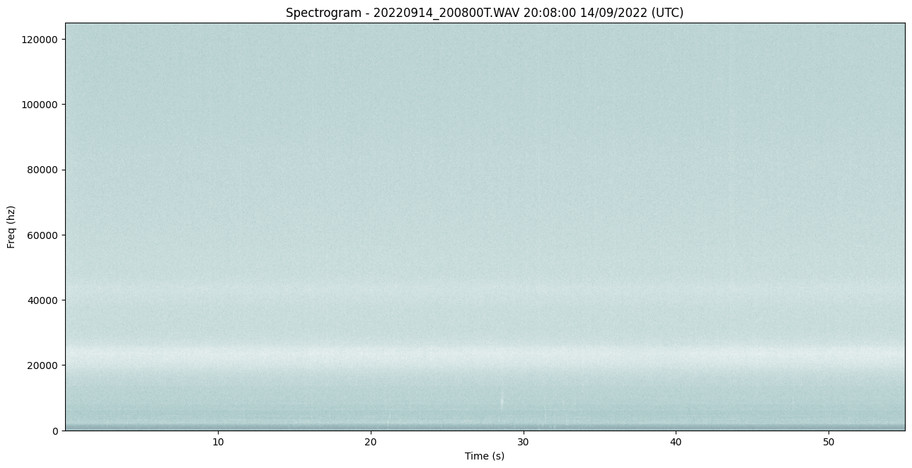
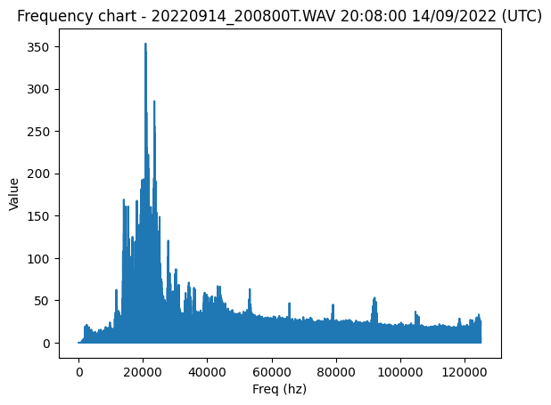
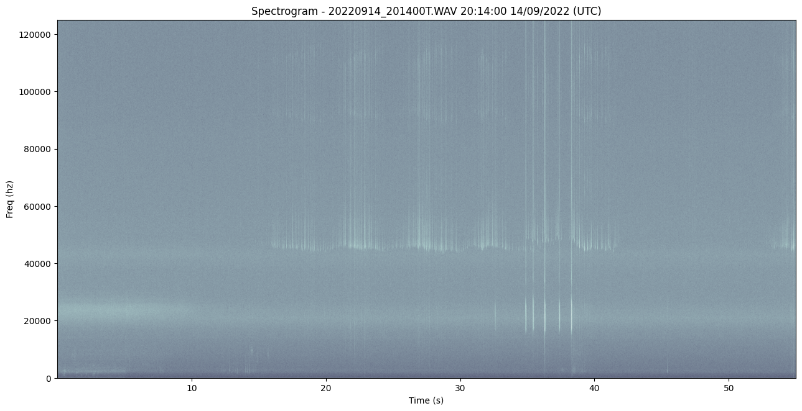
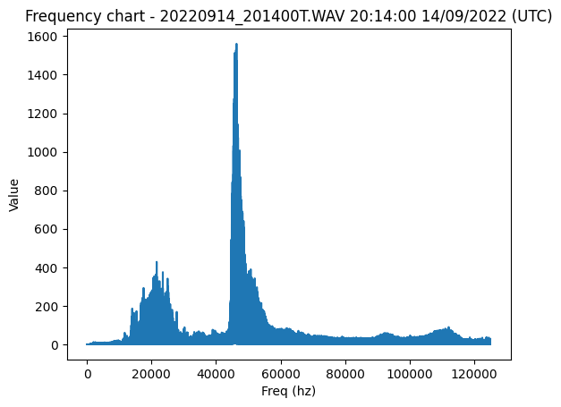
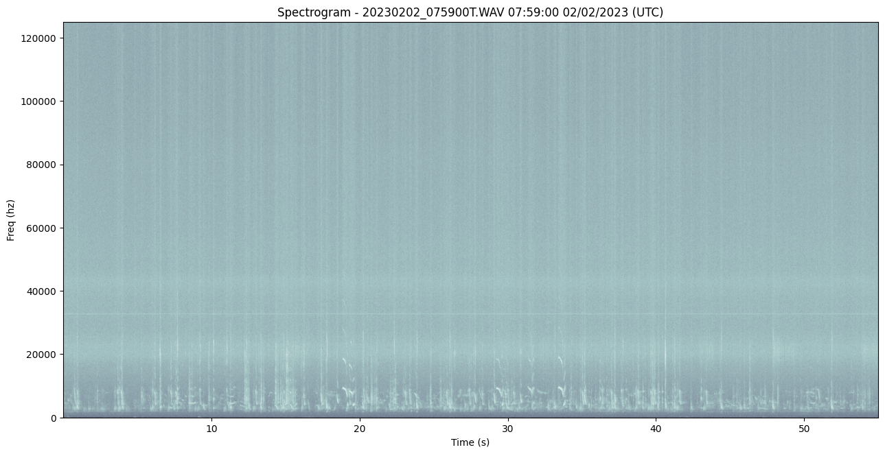
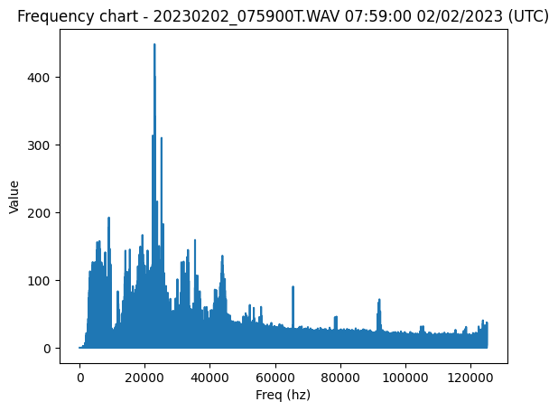

# AudioMoth WAV File Processing

This notebook can be used to generate frequency and spectrogram charts from the AudioMoth files as JPEG files allowing further analysis. 
It can also do some basic classification of the files according to some configuration of frequency ranges and amplitude thresholds
moving the files into subdirectories according to whether the amplitude in a given frequency range exceeds the threshold. 
During processing, the frequency and spectrogram plots are output into the notebook.

The overall purpose is to find the files of interest with strong evidence of bat passes or birds so the that a subset of a large
collection of files can be further analysed. For bats this can be used to choose a set of files to upload to BTO Acoustic Pipeline
for example to save on bandwidth and system resources when an otherwise much larger set may have been submitted.

## How to use
- Set required frequency ranges / thresholds and run the config section
- Set the file folder path and / or run the folder path section and choose with the file browser
- Run the processing section and wait for completion
- Processed files will be moved to sub-folders with JPEG files for frequency / spectral analysis alongside
- Make sure the drive has sufficient storage for the generated JPEG files, up to 1Mb per WAV file processed
- For unclassified files, change thresholds and re-run on those as required

## Frequency Ranges and Thresholds for Classification

- Audiomoth WAV files will be moved into classification folders for bats, birds etc
- The 'freqRanges' entry name is used for the folder
- The 'freqRanges' items are processed in order, the first classification wins!
- Unclassified files moved to a subfolder "unclassified"


```python
freqRanges = {
    # Bats 40Khz to 60Khz, threshold 400
    'bats': [40000,60000,400],

    # Birds 1Khz to 12Khz, threshold 100
    'birds':[1000,12000,100],

    # Birds 1Khz to 12Khz, threshold 50
    'birds_quiet':[1000,12000,65]
}
print('Frequency ranges and thesholds: ', freqRanges)
```

    Frequency ranges and thesholds:  {'bats': [40000, 60000, 400], 'birds': [1000, 12000, 100], 'birds_quiet': [1000, 12000, 65]}


## Set or Choose Folder Path

Note: Processing will create sub-folders in the path where the WAV files reside and move the files around. Keep a master / backup copy!


```python

# ** Set path to files folder here **
path = '/Users/bill/Documents/AudioMoth/test/'

# Browse for path 
from ipyfilechooser import FileChooser
fdialog = FileChooser(
    path,
    title='<b>Browse to Recordings to Process</b>',
    show_hidden=False,
    select_default=True,
    use_dir_icons=True,
    show_only_dirs=True
)
display(fdialog)
```


    FileChooser(path='/Users/bill/Documents/AudioMoth/test', filename='', title='<b>Browse to Recordings to Proces…


## File Processing

Main processing script to process all AudioMoth files. Execute this after setting up classifcaton config and the file path.


```python
# Main processing script...
import numpy as np
import os
import fnmatch
from tinytag import TinyTag
import re
import shutil
import logging
import time

import matplotlib.pyplot as plt
%matplotlib inline

import scipy.signal as sp

from scipy.fft import *
from scipy import signal

# Will be initialised from freqRanges during processing
freqRangeOfInterest = []
fileOfInterestThreshold = 300.0

# Don't Show Warning Messages
import warnings
warnings.filterwarnings('ignore')

# Path from file dialog - defaults to one set above
path=fdialog.selected
print("Path is: ", path)

# Set up logging to a file in the path
log_file_full_path = os.path.join(path, time.strftime("%Y%m%d-%H%M%S")+'_log.txt')
print('Logging to:'+log_file_full_path)
logging.basicConfig(filename=log_file_full_path, encoding='utf-8', level=logging.INFO,format='%(asctime)s %(message)s')
logging.info('Processing directory:'+path)

# Stats counter
stats ={}

# Find files and sort them..
files = fnmatch.filter(os.listdir(path), "*.WAV")
files.sort()
print(files)
logging.info('Found files: '+str(files))

# Stats for total files and unclassified
stats['Total Files'] = len(files)
stats['Unclassified'] = 0
stats['MaxUnclassified'] = 0
stats['MinUnclassified'] = 0

# AudioMoth voltage and temperature stats from the files
stats['MaxVolts'] = 0.0
stats['MinVolts'] = 0.0
stats['MaxTemp'] = 0.0
stats['MinTemp'] = 0.0

import soundfile as sf

# Log and print
def logAndPrint(item):
    print(item)
    logging.info(item)

# Define helper functions

# Load a .wav file. 
# These are 24 bit files. The PySoundFile library is able to read 24 bit files.
# https://pysoundfile.readthedocs.io/en/0.9.0/
def get_wav_info(wav_file):
    data, rate = sf.read(wav_file)
    return data, rate

#
# Load spectrogram
#
# source: Andrew Ng Deep Learning Specialization, Course 5
def graph_spectrogram(data, rate):
    nfft = 2048 # Length of each window segment
    fs = rate #384000 # Sampling frequencies
    print("Rate:", rate)
    noverlap = 12 # Overlap between windows
    nchannels = data.ndim
    print("Channels:", nchannels)
    
    widthHeight = (15.32, 7.49)
    plt.figure(figsize=widthHeight)
    if nchannels == 1:
        pxx, freqs, bins, im = plt.specgram(data, NFFT=nfft, Fs=fs, Fc=0, noverlap=noverlap, cmap=plt.cm.bone, sides='default', mode='default', scale='dB')
        #pxx, freqs, bins, im = plt.specgram(data, nfft, fs, noverlap = noverlap,cmap = plt.cm.bone)
    elif nchannels == 2:
        pxx, freqs, bins, im = plt.specgram(data[:,0], NFFT=nfft, Fs=fs, Fc=0, noverlap=noverlap, cmap=plt.cm.bone, sides='default', mode='default', scale='dB')
        #pxx, freqs, bins, im = plt.specgram(data[:,0], nfft, fs, noverlap = noverlap,cmap = plt.cm.bone)
        

#
# Plot and return freq max values using FFT
#
# TO DO : Check some bucket ranges of interest, e.g. BATs:
#
# 22Khz - 30 Khz
# 40Khz - 60 Khz
#
def get_plot_freqs(data, rate, plotDone):
    N = len(data)
    yf = np.fft.rfft(data)
    xf = np.fft.rfftfreq(N, d=1./rate)
    
    # Filter out 32Hhz noise signal spike which I seem to get in the data
    f32khz = np.where(np.logical_and(xf>=32500.0, xf<=32900.0))
    if np.size(f32khz) > 0:
        yf[f32khz] = 0.0 
            
    # Filter out low frequency spike
    fLow = np.where(np.logical_and(xf>=0.0, xf<=1000.0))
    if np.size(fLow) > 0:
        yf[fLow] = 0.0    
        
    # Get max in the range (e.g. bat detection)
    finterest_max_val = 0
    finterest = np.where(np.logical_and(xf>=freqRangeOfInterest[0], xf<=freqRangeOfInterest[1]))
    if np.size(finterest) > 0:
        finterest_max_val = np.max(np.abs(yf[finterest]))
  
    # Now get the max frequency on the FFT values bucket
    idx = np.argmax(np.abs(yf))
    max_freq = xf[idx]  
    max_freq_val = np.abs(yf[idx])
    
    # Do out plot of frequencies with the 32Khz spike attenuated..
    if plotDone == False:
        plt.plot(xf, np.abs(yf))
    
    # Return the frequency and max val
    return max_freq, max_freq_val, finterest_max_val

#
# Get the comment tag and recorded time
#
def get_comment_and_recorded_time(wav_file):
    comment = ''
    recorded_time = ''
    temperature = ''
    battery = ''
    tag = TinyTag.get(file_full_path)

    # Recorded at 01:09:00 07/09/2021 (UTC) by AudioMoth 247AA506603EC3A8 at medium-high gain while battery was 4.0V and temperature was 22.6C
    if not tag.comment is None:
        comment = tag.comment
        m = re.search('Recorded at (.+?) by AudioMoth (.+?) at (.+?) while battery was (.+?)V and temperature was (.+?)C', comment)
        if m:
            recorded_time = m.group(1)
            battery = m.group(4)
            temperature = m.group(5)

    return tag.comment, recorded_time, battery, temperature

#
# Processing here...
#
from pydub import AudioSegment
import IPython
import time


# Create candidates dirs and stats for each freq range
for freqRangeKey in freqRanges:
    # dirs
    candidate_dir = os.path.join(path, str(freqRangeKey))
    if not os.path.isdir(candidate_dir):
        print('Creating candidate dir: ', candidate_dir)
        os.mkdir(candidate_dir)

    # Stats init
    stats[str(freqRangeKey)] = 0
    stats['Max'+str(freqRangeKey)] = 0
    stats['Min'+str(freqRangeKey)] = 0
        
# Create unclassified dir. Copy unclassified files into here..
unclassified_dir = os.path.join(path, 'unclassified')
if not os.path.isdir(unclassified_dir):
    print('Creating unclassified files dir: ', unclassified_dir)
    os.mkdir(unclassified_dir)

# Iterate all the found WAV files in the directory
for index, singfile in enumerate(files):
         
    # Full path to the file
    file_full_path = os.path.join(path, singfile)
    
    # Spectrogram and frequency chart file paths
    spectrogram_path = file_full_path + '_spec.jpg'
    freq_chart_path = file_full_path + '_freq.jpg'
    
    # Get comment and recorded time, voltage, temp
    comment, recorded_time, battery, temperature = get_comment_and_recorded_time(file_full_path)

    # Update stats on temp / voltage
    if float(temperature) > stats['MaxTemp']:
        stats['MaxTemp'] = float(temperature)
    if float(temperature) < stats['MinTemp'] or stats['MinTemp'] == 0.0:
        stats['MinTemp'] = float(temperature)
    if float(battery) > stats['MaxVolts']:
        stats['MaxVolts'] = float(battery)
    if float(battery) < stats['MinVolts'] or stats['MinVolts'] == 0.0:
        stats['MinVolts'] = float(battery)

    # Print some useful info about the files...
    print('--------------------------------------------------------------------------------------------------')
    logAndPrint('File: '+file_full_path)
    logAndPrint('Spectrogram:'+spectrogram_path)
    logAndPrint('Details: '+comment)
    logAndPrint('Recorded time: '+recorded_time)
    logAndPrint('Battery voltage: '+battery)
    logAndPrint('Temperature: '+temperature)
    
    # Get the WAV file data and sample rate
    data, rate = get_wav_info(file_full_path)
    logAndPrint('Sample rate: '+str(rate))

    # Plot the spectrogram. Ignore the returned item.. 
    graph_spectrogram(data, rate)    
    plt.title("Spectrogram - " + singfile + " " + recorded_time)
    plt.xlabel('Time (s)')
    plt.ylabel('Freq (hz)')
    plt.savefig(spectrogram_path, dpi=300, bbox_inches='tight')
    plt.show()

    # Now classify into folders according to frequency ranges configured
    fileClassified = False
    freqPlotDone = False
    for freqRangeKey in freqRanges:

        # May aleady be classified...
        if fileClassified == False:
            logAndPrint('** Checking for : '+str(freqRangeKey))

            freqRangeOfInterest = [freqRanges[freqRangeKey][0],freqRanges[freqRangeKey][1]]
            fileOfInterestThreshold = freqRanges[freqRangeKey][2]

            logAndPrint('Start frequency : '+str(freqRangeOfInterest[0]))
            logAndPrint('End frequency : '+str(freqRangeOfInterest[1]))
            logAndPrint('Threshold : '+str(fileOfInterestThreshold))
        
            # Get the frequency data
            max_freq, max_freq_val, finterest_max_val = get_plot_freqs(data, rate, freqPlotDone)
            
            # Plot it if not done..
            if freqPlotDone == False:
                plt.title("Frequency chart - " + singfile + " " + recorded_time)
                plt.xlabel('Freq (hz)')
                plt.ylabel('Value')
                plt.savefig(freq_chart_path, dpi=300, bbox_inches='tight')
                plt.show()
                freqPlotDone = True
            
            logAndPrint('Max freq Khz: '+str(max_freq/1000))
            logAndPrint('Max freq value: '+str(max_freq_val))
            logAndPrint('Freq of interest range (Khz): '+str(freqRangeOfInterest[0]/1000)+','+str(freqRangeOfInterest[1]/1000))
            logAndPrint('Max value in range of interest: '+str(finterest_max_val))
            
            if finterest_max_val > fileOfInterestThreshold:
                logAndPrint('** File: '+singfile+' looks interesting for '+str(freqRangeKey)+'!! Moving to candidates dir: '+str(freqRangeKey))
                logging.info('CANDIDATE file: '+singfile)
                candidate_dir = os.path.join(path, str(freqRangeKey))
                shutil.move(file_full_path, os.path.join(candidate_dir, singfile))
                shutil.move(spectrogram_path, os.path.join(candidate_dir, singfile)+'_spec.jpg')
                shutil.move(freq_chart_path, os.path.join(candidate_dir, singfile)+'_freq.jpg')
                stats[str(freqRangeKey)]+=1

                if finterest_max_val > stats['Max'+str(freqRangeKey)]:
                    stats['Max'+str(freqRangeKey)] = finterest_max_val

                if finterest_max_val < stats['Min'+str(freqRangeKey)] or stats['Min'+str(freqRangeKey)] == 0:
                    stats['Min'+str(freqRangeKey)] = finterest_max_val 

                fileClassified = True

    # If file not classified, chuck it into the unclassified dir
    if fileClassified == False:
        print('** File: '+singfile+' moving to UNCLASSIFIED dir.') 
        logging.info('Non-candidate file: '+singfile)
        shutil.move(file_full_path, os.path.join(unclassified_dir, singfile))
        shutil.move(spectrogram_path, os.path.join(unclassified_dir, singfile)+'_spec.jpg')
        shutil.move(freq_chart_path, os.path.join(unclassified_dir, singfile)+'_freq.jpg')
        stats['Unclassified']+=1

        if finterest_max_val > stats['MaxUnclassified']:
            stats['MaxUnclassified'] = finterest_max_val

        if finterest_max_val < stats['MinUnclassified'] or stats['MinUnclassified'] == 0:
            stats['MinUnclassified'] = finterest_max_val   

# End of processing 
logAndPrint(stats)
logging.shutdown()    
print("** Finished **")
        
        
```

    Path is:  /Users/bill/Documents/AudioMoth/test/
    Logging to:/Users/bill/Documents/AudioMoth/test/20230203-185201_log.txt
    ['20220914_200800T.WAV', '20220914_201400T.WAV', '20230202_075900T.WAV']
    --------------------------------------------------------------------------------------------------
    File: /Users/bill/Documents/AudioMoth/test/20220914_200800T.WAV
    Spectrogram:/Users/bill/Documents/AudioMoth/test/20220914_200800T.WAV_spec.jpg
    Details: Recorded at 20:08:00 14/09/2022 (UTC) by AudioMoth 247AA506603EC3A8 at medium-high gain while battery was 4.1V and temperature was 19.1C. High-pass filter with frequency of 50.5kHz applied. Amplitude threshold was 192 with 2s minimum trigger duration.
    Recorded time: 20:08:00 14/09/2022 (UTC)
    Battery voltage: 4.1
    Temperature: 19.1
    Sample rate: 250000
    Rate: 250000
    Channels: 1


    

    


    ** Checking for : bats
    Start frequency : 40000
    End frequency : 60000
    Threshold : 400


    

    


    Max freq Khz: 20.812981818181814
    Max freq value: 353.3932964145488
    Freq of interest range (Khz): 40.0,60.0
    Max value in range of interest: 66.78926631297864
    ** Checking for : birds
    Start frequency : 1000
    End frequency : 12000
    Threshold : 100
    Max freq Khz: 20.812981818181814
    Max freq value: 353.3932964145488
    Freq of interest range (Khz): 1.0,12.0
    Max value in range of interest: 62.346688998903154
    ** Checking for : birds_quiet
    Start frequency : 1000
    End frequency : 12000
    Threshold : 65
    Max freq Khz: 20.812981818181814
    Max freq value: 353.3932964145488
    Freq of interest range (Khz): 1.0,12.0
    Max value in range of interest: 62.346688998903154
    ** File: 20220914_200800T.WAV moving to UNCLASSIFIED dir.
    --------------------------------------------------------------------------------------------------
    File: /Users/bill/Documents/AudioMoth/test/20220914_201400T.WAV
    Spectrogram:/Users/bill/Documents/AudioMoth/test/20220914_201400T.WAV_spec.jpg
    Details: Recorded at 20:14:00 14/09/2022 (UTC) by AudioMoth 247AA506603EC3A8 at medium-high gain while battery was 4.1V and temperature was 19.6C. High-pass filter with frequency of 50.5kHz applied. Amplitude threshold was 192 with 2s minimum trigger duration.
    Recorded time: 20:14:00 14/09/2022 (UTC)
    Battery voltage: 4.1
    Temperature: 19.6
    Sample rate: 250000
    Rate: 250000
    Channels: 1


    

    


    ** Checking for : bats
    Start frequency : 40000
    End frequency : 60000
    Threshold : 400


    

    


    Max freq Khz: 46.375145454545454
    Max freq value: 1560.486520781857
    Freq of interest range (Khz): 40.0,60.0
    Max value in range of interest: 1560.486520781857
    ** File: 20220914_201400T.WAV looks interesting for bats!! Moving to candidates dir: bats
    --------------------------------------------------------------------------------------------------
    File: /Users/bill/Documents/AudioMoth/test/20230202_075900T.WAV
    Spectrogram:/Users/bill/Documents/AudioMoth/test/20230202_075900T.WAV_spec.jpg
    Details: Recorded at 07:59:00 02/02/2023 (UTC) by AudioMoth 247AA506603EC3A8 at medium-high gain while battery was 3.9V and temperature was 10.9C. High-pass filter with frequency of 50.5kHz applied. Amplitude threshold was 192 with 2s minimum trigger duration.
    Recorded time: 07:59:00 02/02/2023 (UTC)
    Battery voltage: 3.9
    Temperature: 10.9
    Sample rate: 250000
    Rate: 250000
    Channels: 1


    

    


    ** Checking for : bats
    Start frequency : 40000
    End frequency : 60000
    Threshold : 400


    

    


    Max freq Khz: 23.010254545454544
    Max freq value: 448.3049139370484
    Freq of interest range (Khz): 40.0,60.0
    Max value in range of interest: 135.934162891006
    ** Checking for : birds
    Start frequency : 1000
    End frequency : 12000
    Threshold : 100
    Max freq Khz: 23.010254545454544
    Max freq value: 448.3049139370484
    Freq of interest range (Khz): 1.0,12.0
    Max value in range of interest: 192.3358013591503
    ** File: 20230202_075900T.WAV looks interesting for birds!! Moving to candidates dir: birds
    {'Total Files': 3, 'Unclassified': 1, 'MaxUnclassified': 62.346688998903154, 'MinUnclassified': 62.346688998903154, 'MaxVolts': 4.1, 'MinVolts': 3.9, 'MaxTemp': 19.6, 'MinTemp': 10.9, 'bats': 1, 'Maxbats': 1560.486520781857, 'Minbats': 1560.486520781857, 'birds': 1, 'Maxbirds': 192.3358013591503, 'Minbirds': 192.3358013591503, 'birds_quiet': 0, 'Maxbirds_quiet': 0, 'Minbirds_quiet': 0}
    ** Finished **


```python

```


```python

```


```python

```


```python

```


